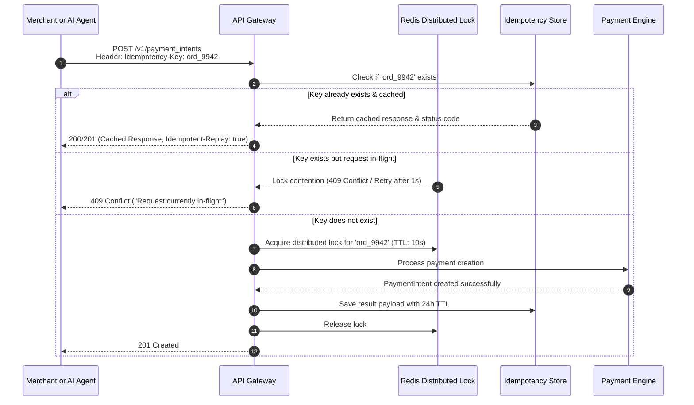

# Distributed Idempotency Architecture

> **Subsystem:** Ingress & State Protection  
> **Key Retention Window:** 24 Hours  
> **Standard:** RFC 9457 / Stripe Idempotency Standard  

---

## 1. Overview & Problem

In distributed payments, network timeouts and retries frequently cause duplicate requests. Without strict idempotency, an automated client or user refreshing during network latency could create multiple duplicate charges for a single shopping cart or API invoice.

OwnPay guarantees **exactly-once execution semantics** for all mutating API requests (`POST /v1/payment_intents`, `POST /v1/refunds`) using a distributed idempotency layer.

---

## 2. Idempotency Flow



---

## 3. Payload Fingerprinting & Conflict Detection

An idempotency key is cryptographically tied to the exact payload of the initial request:

```text
Fingerprint = SHA256(HTTP_METHOD + ":" + PATH + ":" + RAW_REQUEST_BODY)
```

- **Exact Match:** If a subsequent request arrives with the same `Idempotency-Key` and matching fingerprint within 24 hours, the cached response is returned immediately.
- **Payload Mismatch:** If a subsequent request arrives with the same `Idempotency-Key` but a **different** request body (e.g., amount changed from $10 to $20), the gateway rejects the request immediately with:
  ```json
  {
    "error": "idempotency_error",
    "message": "Idempotency-Key 'ord_9942' was already used for a different request payload."
  }
  ```
