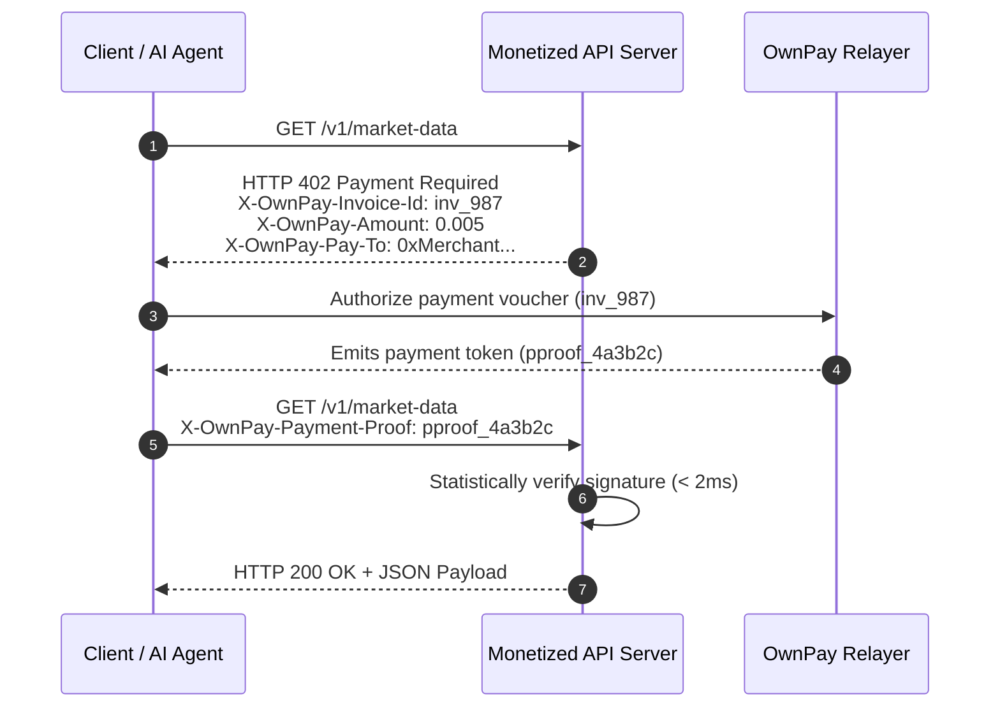

# x402 Protocol Handshake

> **Protocol:** `RFC-x402-2026`  
> **Classification:** Machine-to-Machine HTTP Monetization  

---

## 1. Handshake Flow



---

## 2. Server Implementation Example

```typescript
import { ownpayX402Middleware } from '@ownpay/sdk/x402';
import express from 'express';

const app = express();

app.get(
  '/api/search',
  ownpayX402Middleware({
    amount: '0.01',
    currency: 'USDC',
    chain: 'base',
    recipientAddress: '0xYourMerchantSettlementAddress...',
  }),
  (req, res) => {
    res.json({ results: ['Result 1', 'Result 2'] });
  }
);
```
