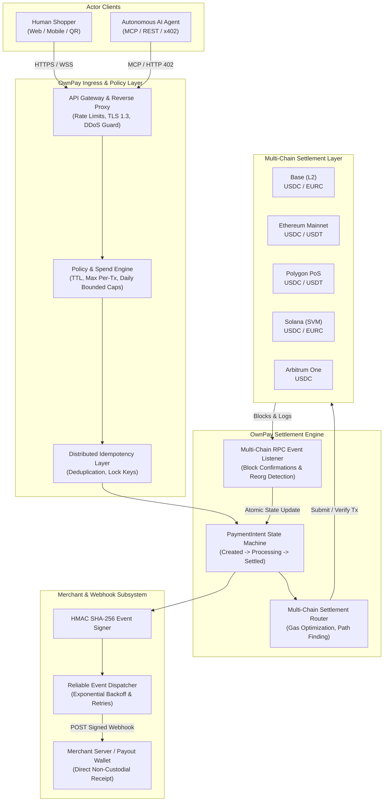

# OwnPay Dual-Rail System Architecture

> **Status:** Technical Architecture Specification  
> **Classification:** Public System Architecture  
> **Layer:** Core Infrastructure  

---

## 1. High-Level Architectural Model

OwnPay is engineered as a high-throughput, non-custodial payment routing and settlement network. The platform provides unified transaction primitives for two fundamentally distinct consumers:

1. **Human Commerce Clients:** Web browsers, mobile wallets, and point-of-sale checkout interfaces requiring reactive UI feedback, QR codes, biometric signatures, and gas abstraction.
2. **Autonomous AI Agents:** Automated software entities, Large Language Models (via Model Context Protocol), and machine-to-machine microservices requiring cryptographic session policies, bounded spend limits, sub-second execution, and programmatic HTTP 402 protocols.

---

## 2. End-to-End System Topology



---

## 3. Core Component Breakdown

### 3.1. API Gateway & Ingress Layer
- **Protocol Termination:** High-performance HTTP/2 and WebSocket ingress with TLS 1.3 termination.
- **Request Authentication:** Dual authentication schemes:
  - `Bearer own_sec_...` for server-to-server authenticated merchant calls.
  - Ephemeral client secrets (`pi_sec_...`) for client-side checkout modal interactions.
  - Signed ECDSA/Ed25519 authorization headers for programmatic AI agents.

### 3.2. Policy & Guardrail Subsystem
When an autonomous AI agent initiates or approves a transaction, the request is intercepted by the Policy Engine:
- **Per-Transaction Cap:** Enforces hard upper-bound USD limits on individual calls.
- **Daily Rolling Cap:** Accumulates expenditure over a 24-hour sliding window.
- **Allowed Merchant Whitelist:** Validates merchant recipient address against pre-approved domain lists.
- **Time-to-Live (TTL):** Ensures ephemeral session authorizations expire automatically if unexecuted.

### 3.3. PaymentIntent State Machine
A deterministic finite state machine governs every transaction:
```text
  [CREATED]
     │
     ▼
[PROCESSING] ──(Reorg / Timeout / Insufficient Funds)──► [FAILED]
     │
     ▼
  [SETTLED]
     │
     ▼
[COMPLETED]
```
- **Guaranteed Idempotency:** Any API call with a matching `Idempotency-Key` header within a 24-hour window returns the cached response, preventing double-billing under flaky network conditions.

### 3.4. Multi-Chain Settlement Subsystem
OwnPay routes settlement to the optimal blockchain chosen by the merchant and supported by the user:
- **Direct Settlement:** Funds transfer directly from the payer's wallet/vault to the merchant's destination wallet.
- **Non-Custodial Escrow (Optional):** Time-locked atomic contracts for conditional milestone payouts or dispute windows.
- **Reorg Protection:** Event listeners wait for chain-specific confirmation thresholds (e.g., 2 blocks on Base, 12 blocks on Ethereum, finalized commitment on Solana) before emitting `payment_intent.succeeded`.

### 3.5. Cryptographic Event Dispatcher
- Once on-chain finality is confirmed, the webhook subsystem computes an HMAC SHA-256 signature using the merchant's private webhook secret.
- Events are queued in an automated retry queue with jittered exponential backoff (up to 72 hours) to ensure merchant servers reliably receive payment notifications even during outages.

---

## 4. Resilience & Security Boundaries

1. **Zero Secret Retention:** Client private keys never touch OwnPay servers. Wallets sign payloads locally via client SDKs or user-managed local agent daemons.
2. **Reorg Mitigation:** The settlement engine monitors block heights and reorganization depths, automatically adjusting confirmation requirements during anomalous network volatility.
3. **Public-Private Isolation:** All core communication protocols, API specifications, and SDK client bindings are open-source and publicly verifiable in OwnPay Lab, while sensitive infrastructure keys remain isolated in hardened hardware security modules (HSMs).
