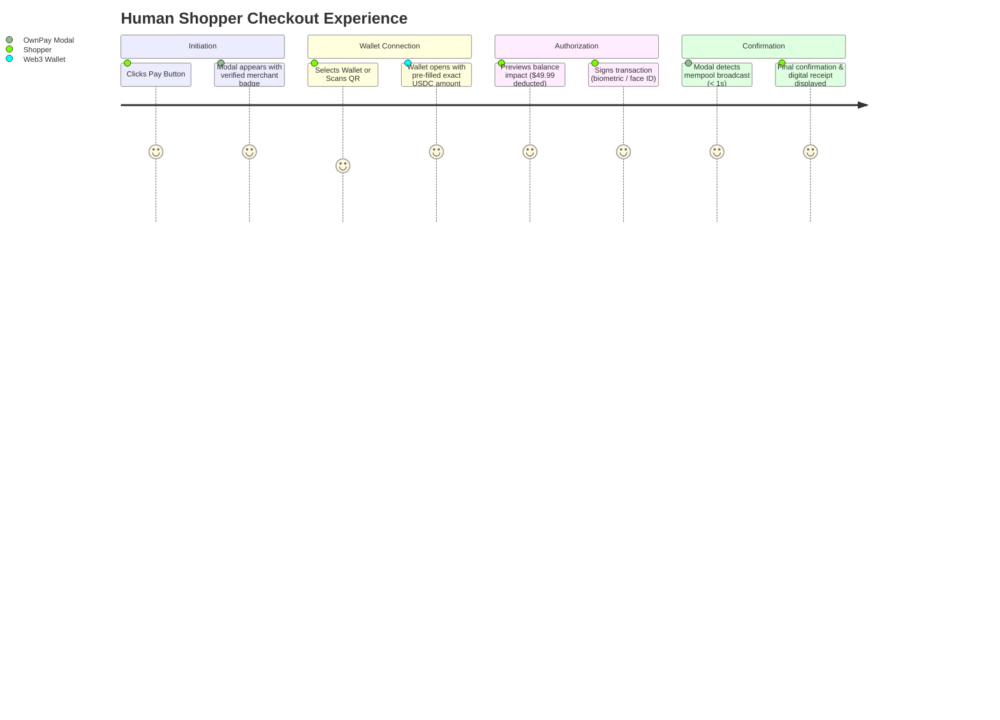

# Rail 1: Human Commerce Architecture

> **Status:** Production Architecture  
> **Target:** Consumer Checkout, E-Commerce, Mobile Apps, Point-of-Sale  

---

## 1. Design Philosophy: Invisible Web3

Traditional crypto payment checkouts force mainstream consumers to understand gas limits, nonces, slippage, and hexadecimal contract signatures. This design causes massive drop-offs.

**The OwnPay Human Commerce Rail** is engineered under a single foundational premise: **Web3 infrastructure should feel as frictionless, fast, and familiar as tapping a modern credit card or mobile wallet, without sacrificing self-sovereignty.**

---

## 2. Core Capabilities

```text
+---------------------------------------------------------------------------------------+
| 1. REACTIVE CHECKOUT MODAL                                                            |
|    Drop-in responsive widget supporting light/dark theme, multi-currency display, and |
|    sub-second status transitions without page refreshes.                              |
+---------------------------------------------------------------------------------------+
| 2. UNIFIED WALLET COMPATIBILITY                                                       |
|    Native support for EVM wallets (MetaMask, Coinbase Wallet, Rainbow), SVM wallets   |
|    (Phantom, Solflare), and universal mobile connection via WalletConnect v2.        |
+---------------------------------------------------------------------------------------+
| 3. DYNAMIC MULTI-CHAIN QR CODES                                                       |
|    EIP-681 and Solana Pay compatible dynamic QR codes allowing desktop shoppers to    |
|    scan and approve payments in seconds using their mobile wallet app.                |
+---------------------------------------------------------------------------------------+
| 4. ZERO-GAS / GAS-ABSTRACTED PAYMENTS                                                 |
|    Supports ERC-4337 paymasters and stablecoin gas payment (EIP-3009 transferWithAuthorization|
|    or Permit2), allowing users to pay purely in USDC without holding ETH or MATIC.    |
+---------------------------------------------------------------------------------------+
| 5. PRE-TRANSACTION SIMULATION & ANTI-PHISHING                                         |
|    Displays plain-English balance changes and verified merchant identity before the  |
|    user signs, eliminating fear of blind contract interactions.                       |
+---------------------------------------------------------------------------------------+
```

---

## 3. Human Checkout User Journey



---

## 4. Integration Modes

### Mode A: Embedded Drop-In Modal
The recommended integration for web applications. The user never leaves the merchant's website:

```html
<!-- Include SDK script -->
<script src="https://www.ownpaylab.dev/sdk/v1/checkout.js"></script>

<script>
  const ownpay = new OwnPayCheckout({
    publishableKey: 'own_pub_test_mock_...',
  });

  // Open modal tied to a server-generated PaymentIntent
  ownpay.open({
    clientSecret: 'pi_sec_mock_987654321',
    theme: 'auto', // 'light' | 'dark' | 'auto'
    onSuccess: (tx) => console.log('Paid successfully:', tx.hash),
    onClose: () => console.log('Checkout dismissed'),
  });
</script>
```

### Mode B: Hosted Checkout Page
For merchants who prefer a hosted redirect flow (similar to Stripe Checkout):
- The merchant backend creates a PaymentIntent and redirects the user to `intent.checkoutUrl`.
- Upon successful settlement, OwnPay redirects the user back to the merchant's specified `returnUrl`.

### Mode C: In-Person / Dynamic QR Codes
For physical retail and point-of-sale terminals:
- POS terminal generates a PaymentIntent and renders the QR code.
- Customer scans with mobile camera or Web3 wallet.
- POS terminal receives WebSocket event and prints receipt immediately.

---

## 5. Security & Consumer Protections

1. **Origin Validation:** The checkout modal runs inside an isolated, cross-origin protected iframe verifying the parent merchant origin against registered domains.
2. **Domain Identity Verification:** Every checkout displays the merchant's verified domain and SSL certificate status.
3. **No Private Key Ingestion:** OwnPay never requests, touches, or stores user seed phrases or private keys. All signing occurs inside the user's authentic wallet software.
