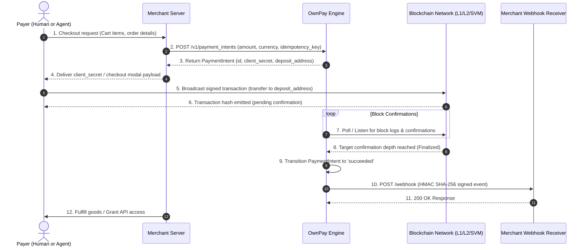

# End-to-End Payment Flow & Lifecycle

> **Status:** Architecture Reference  
> **Applicability:** Human Checkout & Autonomous AI Agent Flows  

---

## 1. The Unified Payment Lifecycle

Every transaction processed by OwnPay follows a deterministic lifecycle managed by the **PaymentIntent Engine**. Regardless of whether the payer is a human using a browser wallet or an AI agent interacting via API, the state machine enforces strict execution order and cryptographic verifiability.

---

## 2. Sequence Diagram



---

## 3. Step-by-Step Breakdown

### Step 1: Intent Creation
- The merchant's backend receives an order from the user or agent.
- The merchant server issues a `POST /v1/payment_intents` call with:
  - `amount`: String representation of fiat or token amount (e.g., `"25.00"`).
  - `currency`: Base pricing currency (e.g., `"USD"`).
  - `settlementToken`: Desired token (e.g., `"USDC"`).
  - `settlementChain`: Target network (e.g., `"base"`).
  - `idempotencyKey`: Unique client-generated key (e.g., `ord_20260915_a78c`).
- OwnPay validates policy limits and reserves a dedicated non-custodial deposit route or smart-contract payment intent session.

### Step 2: Payment Execution
- **For Human Checkout:** The frontend checkout modal prompts the user to connect their wallet (MetaMask, Coinbase Wallet, Phantom, or WalletConnect) or scan a dynamic QR code. The user signs the transfer transaction.
- **For AI Agent:** The agent receives an HTTP `402 Payment Required` challenge or MCP tool payload, verifies the invoice against its local policy limits, and signs the transaction programmatically using its scoped session key.

### Step 3: Confirmation & Reorg Protection
- The transaction is broadcast to the target blockchain.
- OwnPay's multi-chain event listeners detect the transaction in the mempool or first block and transition the intent state to `processing`.
- The engine enforces chain-specific finality thresholds before marking the intent `succeeded`:
  - **Base / Arbitrum:** 2 block confirmations
  - **Polygon PoS:** 32 block confirmations (or state sync finality)
  - **Solana:** `finalized` commitment (32+ slots)
  - **Ethereum L1:** 12 block confirmations (Safe/Finalized block)

### Step 4: Webhook Dispatch & Order Fulfillment
- OwnPay signs the event payload using HMAC-SHA256 and dispatches it to the merchant's registered webhook endpoint.
- Upon receiving HTTP `200 OK`, the event is recorded as delivered.
- The merchant server marks the order paid and provisions the goods, digital access, or API quota.

---

## 4. PaymentIntent State Machine

```text
               +---------------------------+
               |          CREATED          |
               +-------------+-------------+
                             |
                   Payment submitted
                             |
                             v
               +---------------------------+
               |        PROCESSING         |
               +-------------+-------------+
                             |
             +---------------+---------------+
             |                               |
    Finality confirmed             Reorg / Expired / Error
             |                               |
             v                               v
+---------------------------+   +---------------------------+
|         SUCCEEDED         |   |          FAILED           |
+---------------------------+   +---------------------------+
             |
   Webhook acknowledged
             |
             v
+---------------------------+
|         COMPLETED         |
+---------------------------+
```

---

## 5. Edge Cases & Resilience

| Scenario | System Behavior | Merchant Action |
| :--- | :--- | :--- |
| **Network Reorg** | Event listener rolls back intent state from `processing` to `requires_payment` until confirmed on canonical fork. | Await definitive `payment_intent.succeeded` webhook before fulfillment. |
| **Underpayment** | Intent state remains `requires_action` with `amount_received < amount_due`. | Prompt user for remaining balance or issue automated refund. |
| **Overpayment** | Intent marks `succeeded` with `excess_amount` recorded in metadata. | Excess balance can be returned or credited to merchant ledger. |
| **Timeout / Expired** | Intent moves to `canceled` after configured TTL (default: 30 minutes). | Generate new PaymentIntent if user re-initiates checkout. |
