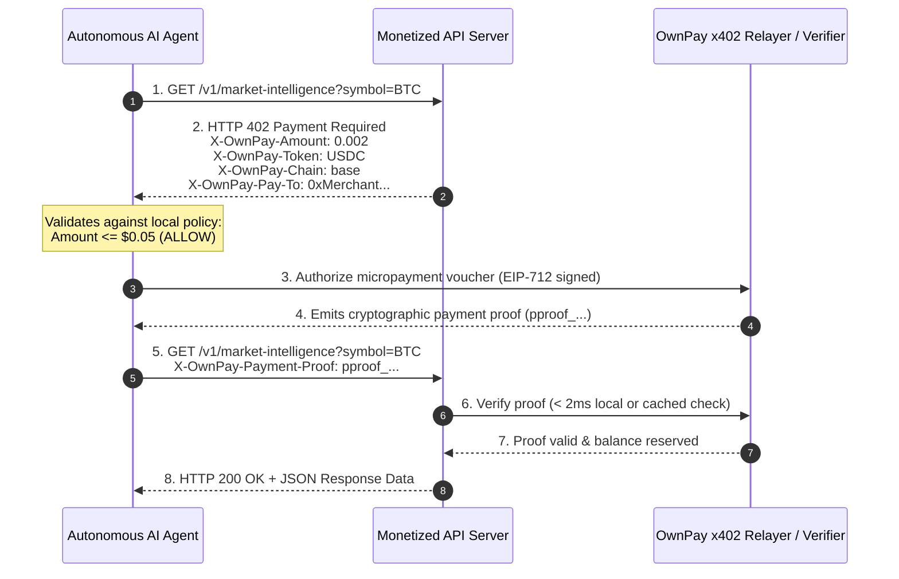

# HTTP 402 Payment Required Protocol (`x402`)

> **Document Status:** Draft Protocol Specification (`RFC-x402-2026`)  
> **Classification:** Open Standard Draft  
> **Status:** [DEVELOPMENT]  

---

## 1. Abstract & Motivation

Since the publication of RFC 2616 in 1999, HTTP Status Code `402 (Payment Required)` has been officially reserved for digital payment schemes, but never universally standardized. As a result, web services have relied on subscription paywalls, API key quotas, and manual monthly billing.

In an agent-driven world where autonomous AI agents consume compute, data, and APIs dynamically on a per-request basis, subscription contracts create severe friction.

The **OwnPay x402 Protocol** standardizes HTTP headers, cryptographic vouchers, and sub-second stablecoin settlement to turn any HTTP endpoint into a native, pay-per-call monetized resource.

---

## 2. Protocol Flow



---

## 3. Standard HTTP Headers

### 3.1. Server Challenge Headers (HTTP 402 Response)

When a client requests a monetized endpoint without valid payment proof, the server responds with status `402`:

```http
HTTP/1.1 402 Payment Required
Content-Type: application/json
X-OwnPay-Version: 2026-09-01
X-OwnPay-Invoice-Id: inv_99f8e7d6c5b4
X-OwnPay-Amount: 0.005
X-OwnPay-Currency: USDC
X-OwnPay-Chain: base
X-OwnPay-Pay-To: 0x71C...3a9
X-OwnPay-TTL: 60

{
  "error": "payment_required",
  "message": "Resource requires 0.005 USDC on Base network",
  "invoiceId": "inv_99f8e7d6c5b4",
  "docs": "https://www.ownpaylab.dev/docs/x402"
}
```

### 3.2. Client Authorization Headers (Retried Request)

The client repeats the original HTTP request, appending the cryptographic proof header:

```http
GET /v1/market-intelligence?symbol=BTC HTTP/1.1
Host: api.provider.com
X-OwnPay-Payment-Proof: pproof_live_7c8d9e0f1a2b3c4d5e6f
```

---

## 4. Server-Side Middleware (Node / Express)

Implementing `x402` monetization requires under 10 lines of code:

```typescript
import { ownpayX402Middleware } from '@ownpay/sdk/x402';
import express from 'express';

const app = express();

// Protect this route with a 0.005 USDC charge on Base
app.get(
  '/v1/market-intelligence',
  ownpayX402Middleware({
    amount: '0.005',
    currency: 'USDC',
    chain: 'base',
    recipientAddress: '0xYourMerchantSettlementAddress...',
  }),
  (req, res) => {
    res.json({
      data: 'Premium market intelligence data payload',
      timestamp: Date.now(),
    });
  }
);
```

---

## 5. Security Guarantees

1. **Replay Protection:** Each `pproof_` token is strictly bound to a single HTTP path, query string, timestamp window, and unique nonce.
2. **Sub-Millisecond Verification:** The payment proof can be validated statelessly using public cryptographic signatures, ensuring zero added latency for high-speed streaming APIs.
3. **Atomic Settlement:** Micropayments batch dynamically into Layer-2 stablecoin settlements to avoid blockchain congestion while maintaining guaranteed payout solvency.
